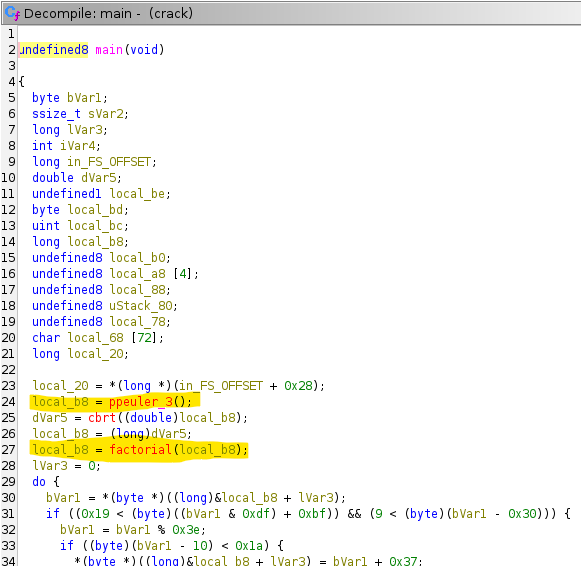

# Duckware Team - CRACKME

<small>This CTF was solved by @mathias</small>

*This CTF is about Reverse Engineering and cryptography.*

---

## Challenge Overview

* **Title:** CRACKME
* **Description:** Find the right password to login.
* **Artifact:** `crack` — a binary executable

---

## Getting started

This writeup documents the static analysis and reasoning used to recover the expected password for the challenge. The analysis was performed targeting a 64-bit ELF binary and used standard reverse-engineering tools (disassembly / decompilation).


## Quick summary

The binary's `main` computes a value derived from the known Project Euler problem #3 constant (600851475143), reduces it by taking the cube root and truncating, computes the factorial of that truncated cube root, then converts the resulting 64-bit integer **byte-by-byte** into an 8-character string using a custom Base62-like mapping. The program then reads an 8-character password from stdin and compares it to the generated string; if it matches exactly, it prints a success message.

---

## Static analysis

### Entry points observed

* `main`
* `ppeuler_3`
* `factorial`

Using a decompiler (Ghidra / IDA / r2) we located the functions above and examined the data flow in `main`. The main points are:

1. Call `ppeuler_3()` to get a number (this function factors the constant 0x8be589eac7 == 600851475143 and returns its largest prime factor).
2. Compute `cbrt()` of that value, cast to `long` (integer truncation).
3. Call `factorial()` on the truncated cube root value.
4. Treat the resulting `long` as 8 bytes in memory (little-endian), iterate over each byte, and apply a byte-level transformation that maps a value `% 62` into the ASCII ranges for `0-9`, `A-Z`, `a-z` depending on the computed bucket. Only bytes that pass a pre-check are transformed; otherwise the byte is left unchanged.
5. Prompt the user with `enter the right password` and read up to 64 bytes, then compare the first 8 input bytes (before the newline) to the 8 transformed bytes generated previously. If they match and length is exactly 8, print success; otherwise print failure.




## `ppeuler_3()` — relation with Project Euler #3

The function `ppeuler_3()` is a straightforward trial-division factorization routine that factors the constant `0x8be589eac7` (600851475143). This constant is the same number used in Project Euler problem #3 ("largest prime factor"). The function returns the largest prime factor found for that constant — which is **6857** (0x1AC9).

This result is used by the rest of the program.


## Cube root and factorial step

* After calling `ppeuler_3()` and obtaining `6857`, the code computes `cbrt(6857)` which is approximately `18.998...`.
* Casting this `double` to `long` truncates to `18`.
* The program then calls `factorial(18)` which (in the original, correct implementation) yields `18! = 6402373705728000` (0x16BEECCA730000).

Note: decompilers sometimes produce imperfect pseudo-code. In the variant inspected, the `factorial` implementation displayed by the decompiler looked like a busy loop; however the binary's intended logic and the comparative results indicate the factorial value `18!` is the numeric base used in the following transformation.


## Byte-by-byte Base62-like conversion

The core transformation in `main` performs the following steps for each of the 8 bytes of the 64-bit `long` (interpreted in little-endian order):

1. Read byte `b` at offset `i` from `&local_b8`.
2. Evaluate a pre-condition on `b` (the code contains a pair of checks written with masking and arithmetic; if the checks fail the byte is left unchanged).
3. If the condition is satisfied, compute `t = b % 62`.
4. Map `t` to an ASCII character using these ranges:

   * `0..9`   -> `'0'..'9'` (add `0x30`)
   * `10..35` -> `'A'..'Z'` (add `0x37`)
   * `36..61` -> `'a'..'z'` (add `0x3D`)
5. Store the mapped ASCII byte back into the same memory location.

After the loop, the 8 bytes in memory represent the password string to compare with user input.

## Reproducing the conversion in Python

To speed up reproduction, we implement the same transformation in Python. The snippet below demonstrates how to take a 64-bit value (the factorial result) and produce the final 8-character string exactly as the binary would.

```python
# kitty_transform.py
import struct


def kitty_transform(local_b8: int) -> str:
    # pack into 8 bytes little-endian
    b = bytearray(struct.pack("<Q", local_b8))

    for i in range(8):
        bVar1 = b[i]

        cond1 = ((bVar1 & 0xDF) + 0xBF) & 0xFF
        cond2 = (bVar1 - 0x30) & 0xFF

        if cond1 > 0x19 and cond2 > 9:
            bVar1 = bVar1 % 0x3E  # modulo 62
            if (bVar1 - 10) & 0xFF < 0x1A:
                b[i] = bVar1 + 0x37  # 'A'..'Z'
            elif (bVar1 + 0x30) & 0xFF < 0x54:
                b[i] = bVar1 + 0x30  # '0'..'9'
            else:
                b[i] = bVar1 + 0x3D  # 'a'..'z'

    return b.decode(errors='replace')


if __name__ == '__main__':
    factorial_value = 6402373705728000  # 18!
    result = kitty_transform(factorial_value)
    print('factorial (hex):', hex(factorial_value))
    print('resulting string:', result)
```

## Result and verification

Using the value `18! = 6402373705728000` (0x16BEECCA730000) and the transformation above, the final 8-character string generated by the binary is:

```
00sGo4M0
```

Feeding this string (followed by Enter) to the binary's stdin should produce the success message.

## Notes on practical reversing

* When using GDB, you can break at `ppeuler_3` and `factorial`, use `finish` to see return values, and inspect `$rax` or the local stack variable to get the 64-bit value used in the transformation.
* If the binary is stripped or optimized, identify the `call` instruction addresses inside `main` and break on the instruction immediately after the `call` to inspect the returned value in `rax`.
* Always confirm endianness: the binary reads bytes from memory as little-endian, i.e., the least significant byte of the `long` is processed first.

## Conclusion

This challenge is a nice combination of small-number math (Project Euler #3), simple numeric processing (cube root + factorial) and a byte-level serialization into a readable password. By carefully following the binary's control flow and reproducing the byte transformation in Python, the expected password can be generated deterministically.


But I still think using <code>gdb</code> could be easier than reproducing base62.

---

*End of writeup*
